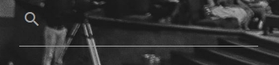
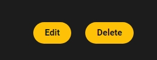
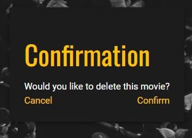
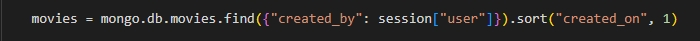

# [CINEVAULT](https://cinevault-f47e66547791.herokuapp.com)

---

# Project Overview: CineVault 

Your Personalized Movie Collection and Management Application. CineVault is a web-based application designed to allow users to create, manage, and explore their own personalised movie collections. The application provides functionality for user registration, login, adding, editing, and deleting movies. The interface dynamically adjusts to display appropriate UI elements based on the users screen size or to what movies they have in their collection.
The application also supports role-based and session-based access control to ensure secure appropriate access within the platform.

## UX

There are countless ideas to consider when starting a CRUD application, but a movie management system stands out for several reasons. It allows for the organisation of movies into collections, updating of their details, and managing them in various states, such as a watchlist. This project naturally involves interacting with a database, providing hands-on experience with querying, updating, and managing records, not just for movies but also for users. Implementing user login and personalized movie management introduces invaluable authorisation concepts, adding additional layers of complexity to the application.

While more intricate ideas, like e-commerce platforms or social networking sites, offer greater complexity, they can also be overwhelming for a project focused on mastering CRUD operations. A movie management system offers the perfect balance between complexity and feasibility, making it an ideal choice for effectively demonstrating CRUD functionality.

### Colour Scheme

The online movie industry often chooses darker themes to create a more immersive environment, but the benefits go beyond simply focusing the viewer's attention. While content is at the heart of these platforms, maximizing watch time is crucial, and dark backgrounds help achieve this by reducing eye strain, allowing users to engage for longer periods. Additionally, dark themes align with the tradition of cinema and enhance the perception of a sleek, luxurious aesthetic, which sets the tone and mood—something platforms like Netflix have mastered.

**1. Dark Background (`#121212` or `#1C1C1C`):**
These deep, near-black shades are reminiscent of a dark movie theater, helping to create an immersive environment that draws users into the content, similar to how dim lighting enhances the experience in a cinema.

**2. Accent Color (Gold/Amber - `#FFC107`):**
Gold and amber tones evoke the allure and excitement of the film industry. These colors suggest luxury, success, and the golden age of cinema.

**3. Accent Color (Crimson Red/Ruby - `#D32F2F`):**
Red is often associated with emotions, drama, and passion, which are central to the storytelling aspect of movies. This color adds depth and intensity to the design, evoking the red carpets of film premieres or the curtains in classic theaters.

**4. Text Color (White or Very Light Gray - `#E0E0E0`):**
White or light gray text on a dark background ensures maximum readability, which is crucial for user experience. This choice keeps the text clear and easy to read without causing eye strain, which is particularly important for longer reading sessions.

### Typography

For this project, I selected a combination of Google Fonts that balances readability, modern aesthetics, and strong visual hierarchy to complement the dark, cinematic theme of the site.

**Heading Typography:**

- **H1 ([Montserrat Subrayada](https://fonts.google.com/specimen/Montserrat+Subrayada?query=mon)):**

I chose Montserrat Subrayada for the primary headings (H1) due to its bold, distinct style with an underline feature that draws attention and creates emphasis. This font captures the modern and cinematic feel, ensuring the main titles stand out while adding a subtle sense of sophistication, perfect for a movie-centric platform.

- **Subheadings (H2-H6: [Oswald](https://fonts.google.com/specimen/Oswald?query=oswald)):**

 I used Oswald because it provides a clean and structured look, giving the site a professional and organized feel. Oswald's strong lines and compact style offer great emphasis across various element sizes, ensuring the subheadings stand out clearly without overpowering the overall design. 

**Body Text ([Roboto](https://fonts.google.com/specimen/Roboto)):**

For the body text, I used Roboto, a versatile and popular sans-serif font. Roboto is highly legible even at smaller sizes, making it ideal for the main text of the website.

**Fallback Font: (Sans-serif):**

In case the primary fonts fail to load, I’ve set a fallback to sans-serif. This ensures that the text remains clean and readable across all devices.

**Icons ([Materialize](https://materializecss.com/icons.html)):**

Using the Materialize framework streamlines the development process by providing pre-built components and responsive design elements. I incorporated various icons from its library to enhance the visual appeal of the application, making the interface more intuitive and engaging for users.

**Favicon ([favicon.io](https://favicon.io/emoji-favicons/cinema)):**

A favicon enhances the user experience by providing a small, recognizable icon that appears in the browser tab, bookmarks, and history, helping users quickly identify and navigate back to your website. It also adds a professional touch and strengthens brand identity.

## User Stories

### New Site Users

- As a new site user, I would like to collate my favorite movies, so that I can enjoy them at a later date.
- As a new site user, I would like to review movies I add, so that can remind myself how I felt.
- As a new site user, I would like to create a watchlist of things I want to see, so that it speeds up the process of me looking for something later.
- As a new site user, I would like an easily searchable list of movies, so that I can find something to watch quickly.
- As a new site user, I would like my movies to be seperated by genre, so that I can different collections of movies.

### Returning Site Users

- As a returning site user, I would like everything to be save, so that I don't have the hassle of re-uploading anything.
- As a returning site user, I would like to easily manageable, so that I can add or remove movies at will.
- As a returning site user, I would like to know when something was last updated, so that I can keep track of my collection.
- As a returning site user, I would like to user-friendly features, so that I can back out of a decision if I want.
- As a returning site user, I would like to know my collection is safe, so that I can have piece of mind.

## Wireframes

To follow best practice, wireframes were developed for mobile, tablet, and desktop sizes.
I've used [Balsamiq](https://balsamiq.com/wireframes) to design my site wireframes.

### Mobile Wireframes

 Click here to see the Mobile Wireframes 

Index
  - 

Account
  - 

### Tablet Wireframes

 Click here to see the Tablet Wireframes 

Index
  - 

Account
  - 

### Desktop Wireframes

 Click here to see the Desktop Wireframes 

Index
  - 

Account
  - 

## Features

### Existing Features

- **Animated Header and Form Fields**

    - The animation provides a smooth, enticing, responsive introduction to the website.

- **Minimalist Homepage**

    - The minimalist homepage focuses user attention only leaving room for the essentials: the logo, logout, add, and search functions.

- **Grey Scale Background**

    - The dark background maintains the theme while adding vibrant elements to capture and retain user attention.

- **Frosted Glass Navigation Bar**

    - The frosted glass navigation bar enhances the theme with a sleek, modern look while keeping the focus on key navigation elements.

- **Side Navigation**

    - The side navigation menu offers a convient navigation tool to mobile users. 

- **Logout**

    - The logout feature gives users a quick and easy way to exit their accounts should they wish to log in again as alternative users. 

- **Flash Messages**

    - Flash messages provide real-time feedback to users by displaying temporary notifications, such as success or error messages, that automatically disappear after a set period.

- **Search Bar**

    - A search bar allows users to quickly find content by entering keywords such as "title", "genre", or "watchlist", enhancing navigation and usability.

- **Dynamic Add Button**

    - The add button dynamically appears based on whether movies are displayed on the screen, preventing overlap and ensuring a clean layout. 

- **Movie Add Form**

    - The movie add form directs user focus by blurring and disabling the background. It turns green upon successful input, providing positive feedback.

- **Movie Card**

    - The movie card delivers clear, straightforward billing of user input and updates dynamically as changes are made.

- **Side Scrolling**

    - As the movie list expands, items stack to the right and eventually transition to a scrollable view, similar to platforms like Netflix.

- **Edit Delete Button**

    - The edit and delete buttons are displayed on each card for easy management, while remaining unobtrusive to maintain a clean page layout.

- **Delete Confirmation**

    - The delete confirmation prompts users to verify their choice before finalising, preventing accidental deletions and ensuring deliberate actions.

- **User Authentication**

    - User authorization ensures secure access by verifying credentials and managing permissions. The role-based system assigns a session token for accessing personal data, keeping the experience both seamless and protected.

- **Session Token Usage**

    - Statements like the example below always verify the current user before displaying any content or routing, ensuring high security.

- **Session Token Error Handling**

    - To prevent brute force attacks, try and except blocks handle errors and redirect unauthorized users back to the index page. 

