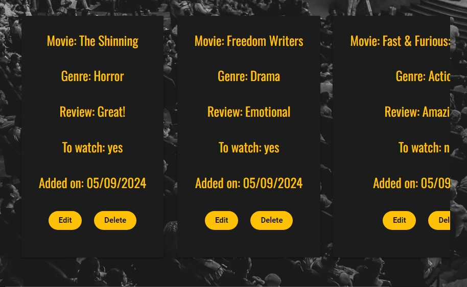
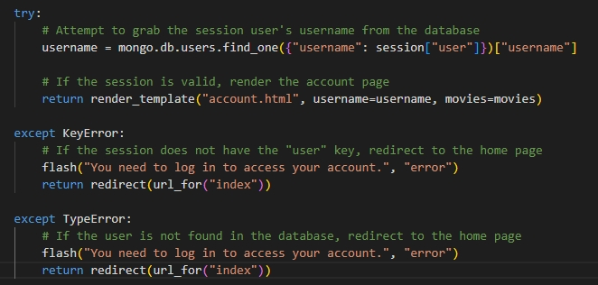

# [CineVault: Personal Movie Collection App](https://cinevault-f47e66547791.herokuapp.com)

[](https://github.com/patrickaod/CineVault/commits/main)
[](https://github.com/patrickaod/CineVault/commits/main)
[](https://github.com/patrickaod/CineVault)

# Project Overview

[CineVault](https://cinevault-f47e66547791.herokuapp.com) is a [Flask](https://flask.palletsprojects.com/en/stable/)-based [CRUD](https://www.codecademy.com/article/what-is-crud) application that lets users manage their personal movie collections with ease. Users can create secure accounts or log in using hashed passwords powered by [Werkzeug](https://werkzeug.palletsprojects.com/en/stable/), and perform actions like adding, editing, deleting, and searching for movies stored in a [MongoDB](https://www.mongodb.com/) database. The app features a dynamic and responsive interface styled with [MaterializeCSS](https://materializecss.com/), while [jQuery](https://jquery.com/) enhances interactivity by animating helper text, dynamically displaying forms, and improving search functionality. CineVault ensures a seamless and intuitive experience for managing movie collections, combining secure authentication, robust data handling, and an engaging user interface.

**Key Features:**
- Role-Based Access Control: Assigns user roles to enable secure and structured permissions.
- User Authentication: Secure account creation and login using hashed passwords via [Werkzeug](https://werkzeug.palletsprojects.com/en/stable/).
- Comprehensive CRUD Functionality: Add, edit, delete, and search movies in a personal collection.
- Dynamic UI: Interactive animations, form transitions, and search optimizations powered by [jQuery](https://jquery.com/).
- Database Integration: Robust movie management using [MongoDB](https://www.mongodb.com/) and [Flask-PyMongo](https://flask-pymongo.readthedocs.io/en/latest/).
- Responsive Design: Sleek and user-friendly navigation, styled with [MaterializeCSS](https://materializecss.com/).
- Robust Validation: Ensures data consistency and security using [Flask](https://flask.palletsprojects.com/en/stable/), [Werkzeug](https://werkzeug.palletsprojects.com/en/stable/), and [MongoDB](https://www.mongodb.com/) tools.


## UX

There are countless ideas to consider when starting a CRUD application, but a movie management system stands out for several reasons. It allows for the organisation of movies into collections, updating of their details, and managing them in various states, such as a watchlist. This project naturally involves interacting with a database, providing hands-on experience with querying, updating, and managing records, not just for movies but also for users. Implementing user login and personalized movie management introduces invaluable authorisation concepts, adding additional layers of complexity to the application.

While more intricate ideas, like e-commerce platforms or social networking sites, offer greater complexity, they can also be overwhelming for a project focused on mastering CRUD operations. A movie management system offers the perfect balance between complexity and feasibility, making it an ideal choice for effectively demonstrating CRUD functionality.

### Colour Scheme

The online movie industry often chooses darker themes to create a more immersive environment, but the benefits go beyond simply focusing the viewer's attention. While content is at the heart of these platforms, maximizing watch time is crucial, and dark backgrounds help achieve this by reducing eye strain, allowing users to engage for longer periods. Additionally, dark themes align with the tradition of cinema and enhance the perception of a sleek, luxurious aesthetic, which sets the tone and mood—something platforms like Netflix have mastered.

**1. Dark Background (`#121212` or `#1C1C1C`):**
These deep, near-black shades are reminiscent of a dark movie theater, helping to create an immersive environment that draws users into the content, similar to how dim lighting enhances the experience in a cinema.

**2. Accent Color (Gold/Amber - `#FFC107`):**
Gold and amber tones evoke the allure and excitement of the film industry. These colors suggest luxury, success, and the golden age of cinema.

**3. Accent Color (Crimson Red/Ruby - `#D32F2F`):**
Red is often associated with emotions, drama, and passion, which are central to the storytelling aspect of movies. This color adds depth and intensity to the design, evoking the red carpets of film premieres or the curtains in classic theaters.

**4. Text Color (White or Very Light Gray - `#E0E0E0`):**
White or light gray text on a dark background ensures maximum readability, which is crucial for user experience. This choice keeps the text clear and easy to read without causing eye strain, which is particularly important for longer reading sessions.


### Typography

For this project, I selected a combination of Google Fonts that balances readability, modern aesthetics, and strong visual hierarchy to complement the dark, cinematic theme of the site.

**Heading Typography:**

- **H1 ([Montserrat Subrayada](https://fonts.google.com/specimen/Montserrat+Subrayada?query=mon)):**

I chose Montserrat Subrayada for the primary headings (H1) due to its bold, distinct style with an underline feature that draws attention and creates emphasis. This font captures the modern and cinematic feel, ensuring the main titles stand out while adding a subtle sense of sophistication, perfect for a movie-centric platform.

- **Subheadings (H2-H6: [Oswald](https://fonts.google.com/specimen/Oswald?query=oswald)):**

 I used Oswald because it provides a clean and structured look, giving the site a professional and organized feel. Oswald's strong lines and compact style offer great emphasis across various element sizes, ensuring the subheadings stand out clearly without overpowering the overall design. 

**Body Text ([Roboto](https://fonts.google.com/specimen/Roboto)):**

For the body text, I used Roboto, a versatile and popular sans-serif font. Roboto is highly legible even at smaller sizes, making it ideal for the main text of the website.

**Fallback Font: (Sans-serif):**

In case the primary fonts fail to load, I’ve set a fallback to sans-serif. This ensures that the text remains clean and readable across all devices.

**Icons ([Materialize](https://materializecss.com/icons.html)):**

Using the Materialize framework streamlines the development process by providing pre-built components and responsive design elements. I incorporated various icons from its library to enhance the visual appeal of the application, making the interface more intuitive and engaging for users.

**Favicon ([favicon.io](https://favicon.io/emoji-favicons/cinema)):**

A favicon enhances the user experience by providing a small, recognizable icon that appears in the browser tab, bookmarks, and history, helping users quickly identify and navigate back to your website. It also adds a professional touch and strengthens brand identity.

## User Stories

### New Site Users

- As a new site user, I would like to collate my favorite movies, so that I can enjoy them at a later date.
- As a new site user, I would like to review movies I add, so that can remind myself how I felt.
- As a new site user, I would like to create a watchlist of things I want to see, so that it speeds up the process of me looking for something later.
- As a new site user, I would like an easily searchable list of movies, so that I can find something to watch quickly.
- As a new site user, I would like my movies to be seperated by genre, so that I can different collections of movies.

### Returning Site Users

- As a returning site user, I would like everything to be save, so that I don't have the hassle of re-uploading anything.
- As a returning site user, I would like to easily manageable, so that I can add or remove movies at will.
- As a returning site user, I would like to know when something was last updated, so that I can keep track of my collection.
- As a returning site user, I would like to user-friendly features, so that I can back out of a decision if I want.
- As a returning site user, I would like to know my collection is safe, so that I can have piece of mind.

## Wireframes

To follow best practice, wireframes were developed for mobile, tablet, and desktop sizes.
I've used [Balsamiq](https://balsamiq.com/wireframes) to design my site wireframes.

### Mobile Wireframes

<details>
<summary> Click here to see the Mobile Wireframes </summary>

Index
  - 

Account
  - 

</details>

### Tablet Wireframes

<details>
<summary> Click here to see the Tablet Wireframes </summary>

Index
  - 

Account
  - 

</details>

### Desktop Wireframes

<details>
<summary> Click here to see the Desktop Wireframes </summary>

Index
  - 

Account
  - 

</details>

## Features

### Existing Features

- **Dynamic Sign-in Form**

    - The animation provides a smooth, enticing, responsive introduction to the website.


- **Minimalist Homepage**

    - The minimalist homepage focuses user attention only leaving room for the essentials: the logo, logout, add, and search functions.


- **Grey Scale Background**

    - The dark background maintains the theme while adding vibrant elements to capture and retain user attention.


- **Frosted Glass Navigation Bar**

    - The frosted glass navigation bar enhances the theme with a sleek, modern look while keeping the focus on key navigation elements.


- **Side Navigation**

    - The side navigation menu offers a convient navigation tool to mobile users. 


- **Logout**

    - The logout feature gives users a quick and easy way to exit their accounts should they wish to log in again as alternative users. 


- **Flash Messages**

    - Flash messages provide real-time feedback to users by displaying temporary notifications, such as success or error messages, that automatically disappear after a set period.


- **Search Bar**

    - A search bar allows users to quickly find content by entering keywords such as "title", "genre", or "watchlist", enhancing navigation and usability.


- **Dynamic Add Button**

    - The add button dynamically appears based on whether movies are displayed on the screen, preventing overlap and ensuring a clean layout. 


- **Movie Add Form**

    - The movie add form directs user focus by blurring and disabling the background. It turns green upon successful input, providing positive feedback.


- **Movie Card**

    - The movie card delivers clear, straightforward billing of user input and updates dynamically as changes are made.


- **Side Scrolling**

    - As the movie list expands, items stack to the right and eventually transition to a scrollable view, similar to platforms like Netflix.



- **Edit Delete Button**

    - The edit and delete buttons are displayed on each card for easy management, while remaining unobtrusive to maintain a clean page layout.


- **Delete Confirmation**

    - The delete confirmation prompts users to verify their choice before finalising, preventing accidental deletions and ensuring deliberate actions.


- **User Authentication**

    - User authorization ensures secure access by verifying credentials and managing permissions. The role-based system assigns a session token for accessing personal data, keeping the experience both seamless and protected.


- **Session Token Usage**

    - Statements like the example below always verify the current user before displaying any content or routing, ensuring high security.


- **Session Token Error Handling**

    - To prevent brute force attacks, try and except blocks handle errors and redirect unauthorized users back to the index page. 




### Future Features

- Friends List:
    - Enables users to follow friends and share movie recommendations, similar to IMDb.
- Intergrated Watchlist:
  - Link movie cards to a dedicated list of watchable movies, with each entry featuring direct links for easy access.
- Movie Card:
  - Upload images to create your own movie titles.
  - Enable the cards to flip between the movie title and the information on the back. 
- Role based - Admin Privileges:
    - User Permissions 
    - Content Management 
    - Theme settings 
    - Component / widget injection (special offers / events)


## Tools & Technologies Used

- [](https://tim.2bn.dev/markdown-builder) used to generate README and TESTING templates.
- [](https://git-scm.com) used for version control. (`git add`, `git commit`, `git push`)
- [](https://github.com) used for secure online code storage.
- [](https://gitpod.io) used as a cloud-based IDE for development.
- [](https://code.visualstudio.com) used as my local IDE for development.
- [](https://en.wikipedia.org/wiki/HTML) used for the main site content.
- [](https://en.wikipedia.org/wiki/CSS) used for the main site design and layout.
- [](https://www.javascript.com) used for user interaction on the site.
- [](https://jquery.com) used for user interaction on the site.
- [](https://www.python.org) used as the back-end programming language.
- [](https://www.heroku.com) used for hosting the deployed back-end site.
- [](https://materializecss.com) used as the front-end CSS framework for modern responsiveness and pre-built components.
- [](https://flask.palletsprojects.com) used as the Python framework for the site.
- [](https://www.mongodb.com) used as the non-relational database management with Flask.
- [](https://balsamiq.com/wireframes) used for creating wireframes.
- [](https://chat.openai.com) used to help debug, troubleshoot, and explain things.
- [](https://coolors.co/) used for selecting cohesive color schemes.  
- [](https://pymongo.readthedocs.io/en/stable/) used for Python-MongoDB integration and data management.  
- [](https://fonts.google.com/) used for modern typography.  
- [](https://werkzeug.palletsprojects.com/) used for password hashing and utility functions.  
- [](https://ezgif.com/) used for creating and optimising GIFs.
- [](https://www.freeconvert.com/) used to reduce video size.
- [](https://www.grammarly.com/) used for proofing. 
 
## Database Design

My project uses a non-relational database with MongoDB, and therefore the database architecture doesn't have actual relationships like a relational database would.

My database is called **project3**.

It contains 2 collections:

- **users**
    | Key | Type | Notes |
    | --- | --- | --- |
    | _id | ObjectId() | |
    | username | String | |
    | password | String | uses Secure Hash Algorithm (scrypt) |
    | role | String | 

- **movies**
    | Key | Type | Notes |
    | --- | --- | --- |
    | _id | ObjectId() | |
    | title | String |  |
    | genre | String | |
    | rating | String | |
    | watchlist | String | |
    | created_by | String | selected from the *users* collection |
    | created_on | Date |  |
    | updated_on | Date |  |

## Testing

> [!NOTE]  
> For all testing, please refer to the [TESTING.md](TESTING.md) file.

## Deployment

The live deployed application can be found deployed on [Heroku](https://cinevault-f47e66547791.herokuapp.com).

### MongoDB Non-Relational Database

This project uses [MongoDB](https://www.mongodb.com) for the Non-Relational Database.

To obtain your own MongoDB Database URI, sign-up on their site, then follow these steps:

- The name of the database on MongoDB should be called **insert-your-database-name-here**.
- The collection(s) needed for this database should be **insert-your-collection-names-here**.
- Click on the **Cluster** name created for the project.
- Click on the **Connect** button.
- Click **Connect Your Application**.
- Copy the connection string, and replace `password` with your own password (also remove the angle-brackets).

### Heroku Deployment

This project uses [Heroku](https://www.heroku.com), a platform as a service (PaaS) that enables developers to build, run, and operate applications entirely in the cloud.

Deployment steps are as follows, after account setup:

- Select **New** in the top-right corner of your Heroku Dashboard, and select **Create new app** from the dropdown menu.
- Your app name must be unique, and then choose a region closest to you (EU or USA), and finally, select **Create App**.
- From the new app **Settings**, click **Reveal Config Vars**, and set your environment variables.

> [!IMPORTANT]  
> This is a sample only; you would replace the values with your own if cloning/forking my repository.

| Key | Value |
| --- | --- |
| `DATABASE_URL` | user's own value |
| `IP` | 0.0.0.0 |
| `MONGO_DBNAME` | user's own value |
| `MONGO_URI` | user's own value |
| `PORT` | 5000 |
| `SECRET_KEY` | user's own value |

Heroku needs three additional files in order to deploy properly.

- requirements.txt
- Procfile
- runtime.txt

You can install this project's **requirements** (where applicable) using:

- `pip3 install -r requirements.txt`

If you have your own packages that have been installed, then the requirements file needs updated using:

- `pip3 freeze --local > requirements.txt`

The **Procfile** can be created with the following command:

- `echo web: python app.py > Procfile`
- *replace **app.py** with the name of your primary Flask app name; the one at the root-level*

The **runtime.txt** file needs to know which Python version you're using:
1. type: `python3 --version` in the terminal.
2. in the **runtime.txt** file, add your Python version:
	- `python-3.9.19`

For Heroku deployment, follow these steps to connect your own GitHub repository to the newly created app:

Either:

- Select **Automatic Deployment** from the Heroku app.

Or:

- In the Terminal/CLI, connect to Heroku using this command: `heroku login -i`
- Set the remote for Heroku: `heroku git:remote -a app_name` (replace *app_name* with your app name)
- After performing the standard Git `add`, `commit`, and `push` to GitHub, you can now type:
	- `git push heroku main`

The project should now be connected and deployed to Heroku!

### Local Deployment

This project can be cloned or forked in order to make a local copy on your own system.

For either method, you will need to install any applicable packages found within the *requirements.txt* file.

- `pip3 install -r requirements.txt`.

If you are using SQLAlchemy for your project, you need to create a local PostgreSQL database.
In this example, the example database name is **db-name**.

```shell
workspace (branch) $ set_pg
workspace (branch) $ psql

... connection to postgres ...

postgres=# CREATE DATABASE db-name;
CREATE DATABASE
postgres=# \c db-name;
You are now connected to database "db-name" as user "foobar".
db-name=# \q
```

Once that database is created, you must migrate the database changes from your models.py file.
This example uses **app-name** for the name of the primary Flask application.

```shell
workspace (branch) $ python3

... connection to Python CLI ...

>>> from app-name import db
>>> db.create_all()
>>> exit()
```

To confirm that the database table(s) have been created, you can use the following:

```shell
workspace (branch) $ psql -d db-name

... connection to postgres ...

postgres=# \dt

	List of relations
Schema | Name | Type | Owner
-------+------+------+--------
public | blah1 | table | foobar
public | blah2 | table | foobar
public | blah3 | table | foobar

db-name=# \q
```

You will need to create a new file called `env.py` at the root-level,
and include the same environment variables listed above from the Heroku deployment steps, plus a few extras.

> [!IMPORTANT]  
> This is a sample only; you would replace the values with your own if cloning/forking my repository.

Sample `env.py` file:

```python
import os

os.environ.setdefault("IP", "0.0.0.0")
os.environ.setdefault("MONGO_DBNAME", "user's own value")
os.environ.setdefault("MONGO_URI", "user's own value")
os.environ.setdefault("PORT", "5000")
os.environ.setdefault("SECRET_KEY", "user's own value")

# local environment only (do not include these in production/deployment!)
os.environ.setdefault("DB_URL", "user's own value")
os.environ.setdefault("DEBUG", "True")
os.environ.setdefault("DEVELOPMENT", "True")
```

If using Flask-Migrate, make sure to include the following steps as well.

During the course of development, it became necessary to update the PostgreSQL data models.
In order to do this, [Flask-Migrate](https://flask-migrate.readthedocs.io) was used.

- `pip3 install Flask-Migrate`
- Import the newly installed package on your main `__init__.py` file:
	- `from flask_migrate import Migrate`
- Define **Migrate** in the same file after **app** and **db** are defined:
	- `migrate = Migrate(app, db)`
- Initiate the migration changes in the terminal:

```shell
workspace (branch) $ flask db init

	... generating migrations ...

workspace (branch) $ set_pg
workspace (branch) $ flask db migrate -m "Add a commit message for this migration"

	... migrating changes ...

workspace (branch) $ flask db upgrade

	... updating database ...
```

#### Cloning

You can clone the repository by following these steps:

1. Go to the [GitHub repository](https://github.com/patrickaod/CineVault) 
2. Locate the Code button above the list of files and click it 
3. Select if you prefer to clone using HTTPS, SSH, or GitHub CLI and click the copy button to copy the URL to your clipboard
4. Open Git shell or Terminal
5. Change the current working directory to the one where you want the cloned directory
6. In your IDE Terminal, type the following command to clone my repository:
	- `git clone https://github.com/patrickaod/CineVault.git`
7. Press Enter to create your local clone.

Alternatively, if using Gitpod, you can click below to create your own workspace using this repository.

[](https://gitpod.io/#https://github.com/patrickaod/CineVault)

Please note that in order to directly open the project in Gitpod, you need to have the browser extension installed.
A tutorial on how to do that can be found [here](https://www.gitpod.io/docs/configure/user-settings/browser-extension).

#### Forking

By forking the GitHub Repository, we make a copy of the original repository on our GitHub account to view and/or make changes without affecting the original owner's repository.
You can fork this repository by using the following steps:

1. Log in to GitHub and locate the [GitHub Repository](https://github.com/patrickaod/CineVault)
2. At the top of the Repository (not top of page) just above the "Settings" Button on the menu, locate the "Fork" Button.
3. Once clicked, you should now have a copy of the original repository in your own GitHub account!

### Local VS Deployment

The local version of your application runs locally with local variables. In contrast, the deployed site on Heroku operates in a production environment with scalable resources, a cloud-based database, and optimized performance settings. Deployment involves pushing code to Heroku, which handles scaling, security, and public access via a live URL. While the local environment is flexible and focused on development, the deployment ensures stability, security, and performance for end users.

## Credits

### Content

| Source | Location | Notes |
| --- | --- | --- |
| [Markdown Builder](https://tim.2bn.dev/markdown-builder) | README and TESTING | tool to help generate the Markdown files |
| [Chris Beams](https://chris.beams.io/posts/git-commit) | version control | "How to Write a Git Commit Message" |
| [Materialize](https://materializecss.com/color.html) | entire site | help with component intergration |
| [W3Schools](https://pymongo.readthedocs.io/en/stable/tutorial.html) | Database | Debug Pymongo |
| [Flask](https://flask.palletsprojects.com/en/3.0.x/) | app.py | how to use the flask packages like werkzeug.security |
| [Mongodb](https://www.w3schools.com/mongodb/index.php) | database | how to use Mongodb |
| [W3Schools](https://www.w3schools.com/python/default.asp) | app.py | how to use Python / Debug |
| [W3Schools](https://www.w3schools.com/python/python_regex.asp) | index | Form filtering |
| [W3Schools](https://www.w3schools.com/js/js_ajax_intro.asp) | account | used to handle get delete request |
| [W3Schools](https://www.w3schools.com/jquery/) | whole site | tutorials for shortening JS |
| [strftime](https://strftime.org) | CRUD functionality | helpful tool to format date/time from string |

### Media

| Source | Location | Type | Notes |
| --- | --- | --- | --- |
| [Pexels](https://www.pexels.com/video/an-empty-movie-theater-7989632/) | entire site | video | index video background |
| [Pexels](https://www.pexels.com/photo/grayscale-photography-of-people-sitting-on-chair-inside-building-2774566/) | account page | image | account image background |
| [favicon.io](https://favicon.io/emoji-favicons/cinema) | entire site | image | site favicon |


### Acknowledgements

- I would like to thank my Code Institute mentor, [Tim Nelson](https://github.com/TravelTimN) for his support throughout the development of this project.
- I would like to thank the [Code Institute](https://codeinstitute.net) tutor team for their assistance with troubleshooting and debugging some project issues.
- I would like to thank the [Code Institute Slack community](https://code-institute-room.slack.com) for the moral support; it kept me going during periods of self doubt and impostor syndrome.
- I would like to thank my partner Eva <3, for believing in me, and allowing me to make this transition into software development.
- I would like to thank my employer, for supporting me in my career development change towards becoming a software developer.
