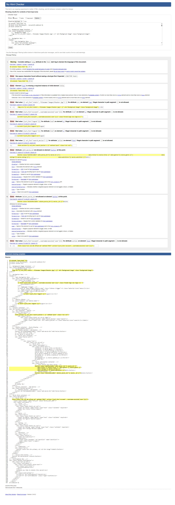
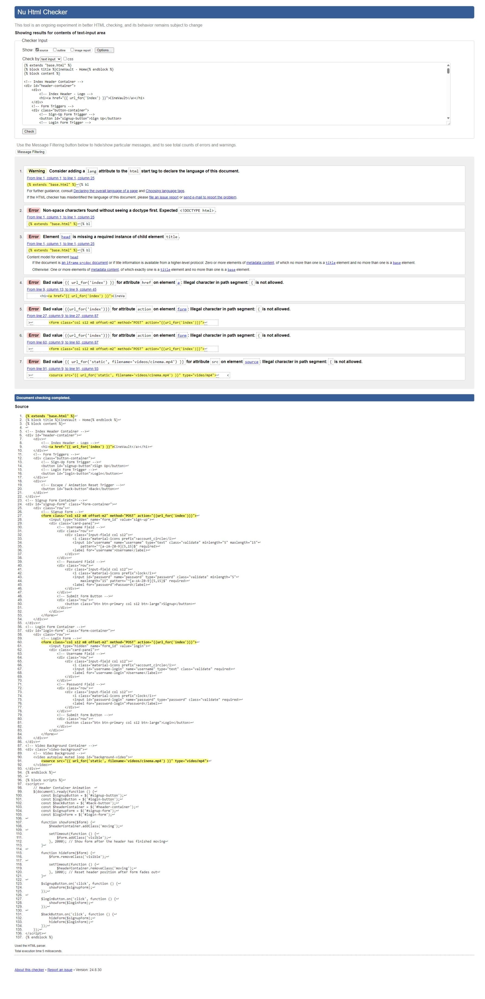
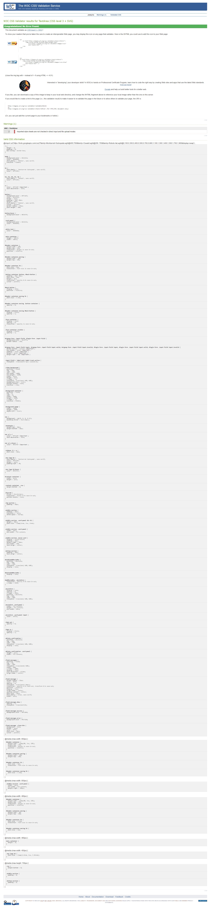
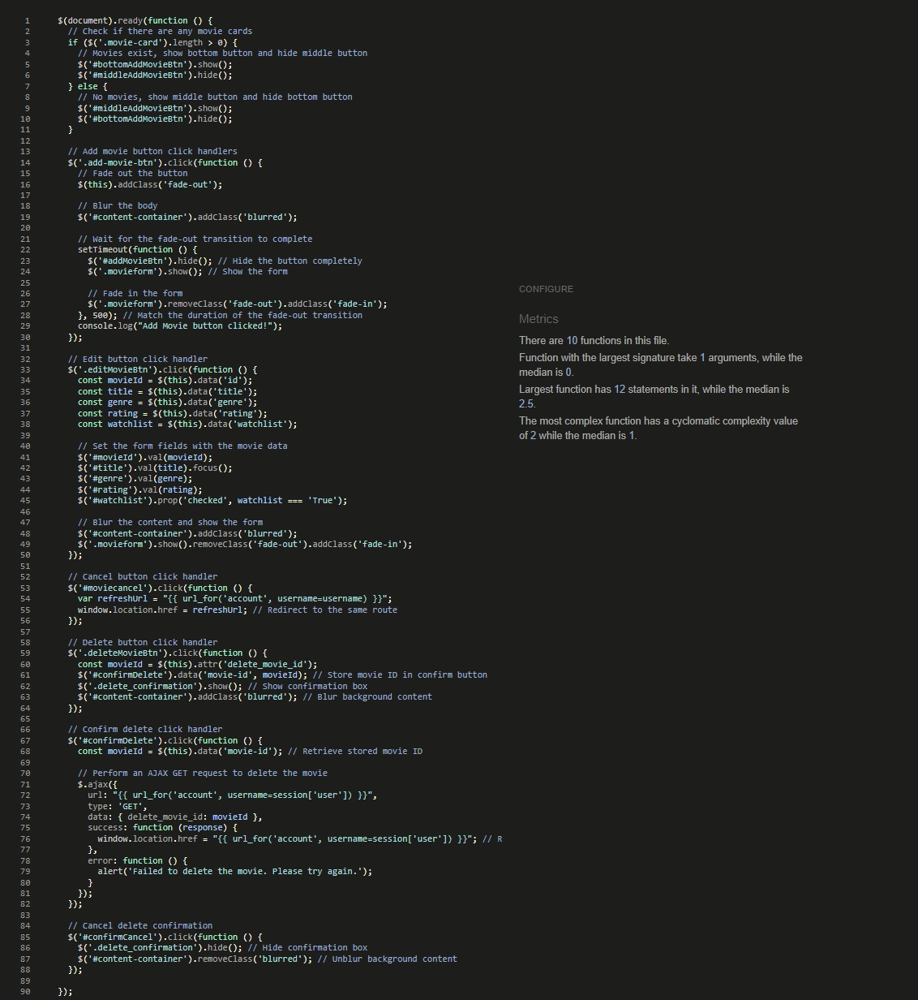
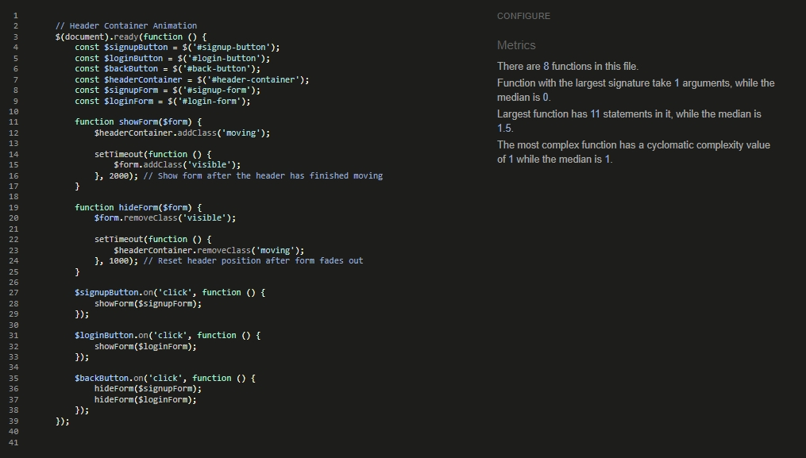
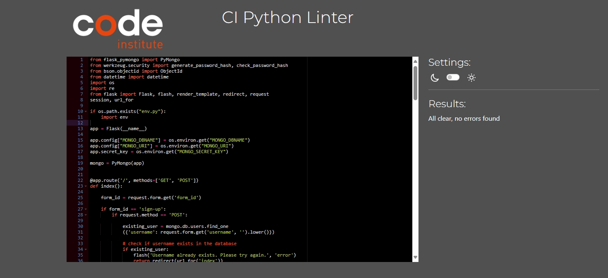

# Testing

> [!NOTE]  
> Return back to the [README.md](README.md) file.

## Code Validation

### HTML

I have used the recommended [HTML W3C Validator](https://validator.w3.org) to validate all of my HTML files.

| Directory | File | Screenshot | Notes |
| --- | --- | --- | --- |
| templates | account.html |  | Errors due to validator unable to interpret jinja |
| templates | index.html |  | Errors due to validator unable to interpret jinja |
| templates | base.html |  | Errors due to validator unable to interpret jinja |

### CSS

I have used the recommended [CSS Jigsaw Validator](https://jigsaw.w3.org/css-validator) to validate all of my CSS files.

| Directory | File | Screenshot | Notes |
| --- | --- | --- | --- |
| static | style.css |  | One warning due to validator unable to interpret @import links |

### JavaScript

I have used the recommended [JShint Validator](https://jshint.com) to validate all of my JS files.

| Directory | File | Screenshot | Notes |
| --- | --- | --- | --- |
| templates | account.html |  | |
| templates | index.html |  | |
| static | script.js |  | |

### Python

I have used the recommended [PEP8 CI Python Linter](https://pep8ci.herokuapp.com) to validate all of my Python files.

| Directory | File | CI URL | Screenshot | Notes |
| --- | --- | --- | --- | --- |
| root | app.py | [PEP8 CI](https://pep8ci.herokuapp.com/https://raw.githubusercontent.com/patrickaod/CineVault/main/app.py) |  | Unfortunately, seperating the mongodb queries prevented the code base from running. To retain stability further investigation is require to resolve these linting issue. |

## Browser Compatibility

I've tested my deployed project on multiple browsers to check for compatibility issues.

| Browser | Home | Account | Notes |
| --- | --- | --- | --- |
| Chrome |  |  | Works as expected |
| Firefox |  | | Works as expected |
| Edge |  |  | Works as expected |

