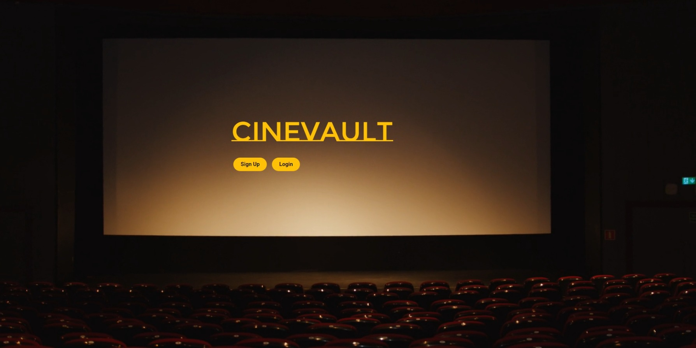
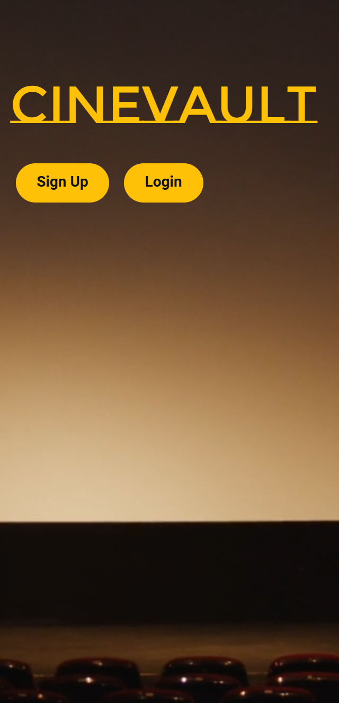
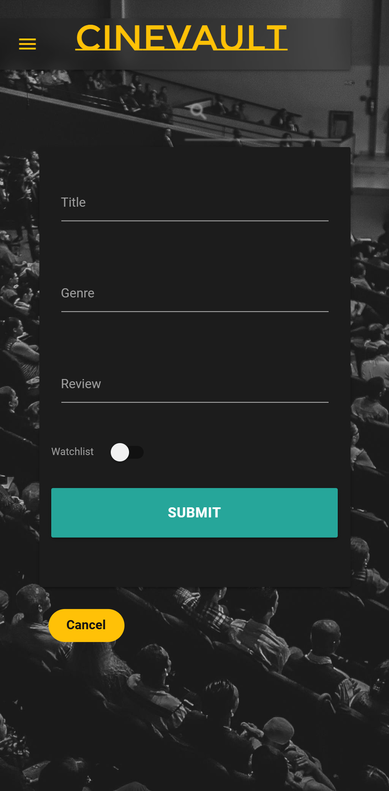

# Testing

> [!NOTE]  
> Return back to the [README.md](README.md) file.

## Code Validation

### HTML

I have used the recommended [HTML W3C Validator](https://validator.w3.org) to validate all of my HTML files.

| Directory | File | Screenshot | Notes |
| --- | --- | --- | --- |
| templates | account.html |  | Errors due to validator unable to interpret Jinja |
| templates | index.html |  | |
| templates | base.html |  | Errors due to validator unable to interpret Jinja |

### CSS

I have used the recommended [CSS Jigsaw Validator](https://jigsaw.w3.org/css-validator) to validate all of my CSS files.

| Directory | File | Screenshot | Notes |
| --- | --- | --- | --- |
| static | style.css |  | One warning due to validator being unable to interpret @import links |

### JavaScript

I have used the recommended [JShint Validator](https://jshint.com) to validate all of my JS files.

| Directory | File | Screenshot | Notes |
| --- | --- | --- | --- |
| templates | account.html |  | |
| templates | index.html |  | |
| static | script.js |  | |

### Python

I have used the recommended [PEP8 CI Python Linter](https://pep8ci.herokuapp.com) to validate all of my Python files.

| Directory | File | CI URL | Screenshot | Notes |
| --- | --- | --- | --- | --- |
| root | app.py | [PEP8 CI](https://pep8ci.herokuapp.com/https://raw.githubusercontent.com/patrickaod/CineVault/main/app.py) |  | Unfortunately, seperating the mongodb queries prevented the code base from running. To retain stability further investigation is required to resolve these linting issue. |

## Browser Compatibility

I've tested my deployed project on multiple browsers to check for compatibility issues.

| Browser | Home | Account | Notes |
| --- | --- | --- | --- |
| Chrome |  |  | Works as expected |
| Firefox |  | | Works as expected |
| Edge |  |  | Works as expected |

## Responsiveness

I've tested my deployed project on multiple devices to check for responsiveness issues.

| Device | Home | About | Notes |
| --- | --- | --- | --- |
| Mobile (DevTools) |  |  | Works as expected |
| Tablet (DevTools) |  |  | Works as expected |
| Desktop |  |  | Works as expected |
| XL Monitor |  |  |  Works as expected |
| Google Pixel 7 Pro |  |  |  Works as expected |

## Lighthouse Audit

Lighthouse is a tool for auditing web pages, assessing performance, accessibility, best practices, and SEO. To test your live site, you can use Chrome DevTools, the Lighthouse CLI, PageSpeed Insights, or Web.dev Measure. Key areas to analyse performance metrics like loading speed and visual stability, accessibility, and SEO. Integrating Lighthouse into your project can helps enhance your site's user experience and search engine visibility.

I've tested my deployed project using the Lighthouse Audit tool to check for any major issues.

| Page | Mobile | Desktop | Notes |
| --- | --- | --- | --- |
| Index |  |  | positive results |
| Account |  |  | positive results |

## Defensive Programming

Defensive programming was manually tested with the below user acceptance testing:

| Page | Expectation | Test | Result | Fix | Screenshot |
| --- | --- | --- | --- | --- | --- |
| Index | | | | | |
| | Header container moves to top right when user clicks a button and displays a form | When user clicks the disappeared buttons it creats multiple forms | The feature didn't behave as expected | There is an easy fix by adding no-pointer events to the class|  |
| | When user clicks back during animation the container should return | Tested the feature by doing the test | The feature did return mid animation, but produced a form | The feature passed the test and this error is produced by the same events-pointer issue. |  |
| Account | | | | | |
| | When the add form is displayed everything should be disabled bar the nav | Tested the feature by doing displaying the form | The feature behaved as expected | Test concluded and passed |  |
| | When the delete confirmation form is displayed everything should be disabled except for the nav | Tested the feature by doing Y | The feature behaved as expected | Test concluded and passed |  |

## User Story Testing

| User Story | Screenshot |
| --- | --- |
| As a new site user, I would like to collate my favorite movies, so that I can enjoy them at a later date.| |
| As a new site user, I would like to review movies I add, so that can remind myself how I felt. |  |
| As a new site user, I would like to create a watchlist of things I want to see, so that it speeds up the process of me looking for something later. |  |
| As a new site user, I would like an easily searchable list of movies, so that I can find something to watch quickly.|  |
| As a new site user, I would like my movies to be seperated by genre, so that I can different collections of movies.|  |
| As a returning site user, I would like everything to be save, so that I don't have the hassle of re-uploading anything.|  |
| As a returning site user, I would like to easily manageable, so that I can add or remove movies at will.|  |
| As a returning site user, I would like to know when something was last updated, so that I can keep track of my collection.|  |
| As a returning site user, I would like to user-friendly features, so that I can back out of a decision if I want.|  |
| As a returning site user, I would like to know my collection is safe, so that I can have peace of mind.|  |

## Automated Testing

For this project I have chosen to not include automated testing. Jest is well-suited for unit testing and mocking in more complex, component-based frameworks like React. However, for the scope of this project, which involves straightforward jQuery operations for class manipulation and Materialize UI components, a simpler approach to testing was deemed more appropriate. The primary aim was to ensure that the application was functional and met its core requirements, and the limited time and resources available were allocated to other critical aspects of development. I fully acknowledge and understand that, in a real-world scenario, an extensive set of additional tests would be more comprehensive.

## Bugs

- Defensive Test: Duplicate forms

    

    - To fix this, I added pointer-events: none to the class.

- Visual issues with flash messages.

    

    - To fix this, I removed a materialize css style by replacing the surrounding blockquotes with div tags.

- Unknown error: Created an issue with the component layout or disabled all the components.

    

    - To fix this, I tracked the issue down to a missing div tag.

- All the label overlap the input in my form fields 
    

    - To fix this, I injected active with my dynamic field injection. 

## Unfixed Bugs

- Unknown Problem: Splitting the MongoDB requests creates Type and Attribute errors outside my codebase

    

    - Attempted fix: The only thing that worked was reassembling the Mongodb queries or statements. 

> [!NOTE]  
> There are no remaining bugs that I am aware of.